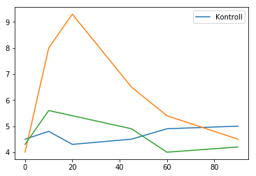
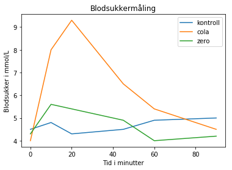
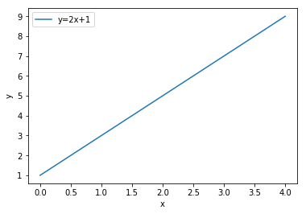
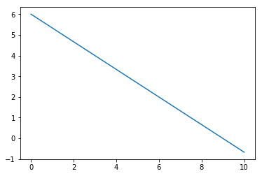
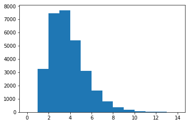

# Funksjoner

```py 
def minFunksjon(argument):
    # Masse 
    # bra 
    # kode
    return svaret
```


I programmering betyr funksjon mye mer enn det gjør i matematikken. I hovedsak så er en funksjon en samling instruksjoner som hører sammen, og som til sammen utfører en oppgave som vi kan sette et navn på. Gjerne noe vi ønsker å kunne utføre flere ganger uten å måtte skrive opp de samme instruksjonene flere ganger.

# Funksjoner
Kompetansemål etter 10. årstrinn
* lage funksjonar som beskriv numeriske samanhengar og praktiske situasjonar, med og utan digitale verktøy, beskrive og tolke dei og omsetje mellom ulike representasjonar av funksjonar, som grafar, tabellar, formlar og tekstar
* identifisere og utnytte eigenskapane til proporsjonale, omvendt proporsjonale, lineære og kvadratiske funksjonar og gje døme på praktiske situasjonar som kan beskrivast med desse funksjonane

## Repetisjon fra forrige gang
Plotting av blodsukkerverdier. Vi legger målepunktene inn i datatypen *liste* og tegner ved hjelp av kommandoen plot. For å klare dette må vi først importere biblioteket `pylab`. 


{:.input_area}
```python
from pylab import *

tid = [0, 10, 20, 45, 60, 90]
kontroll = [4.5, 4.8, 4.3, 4.5, 4.9, 5]
cola = [4.0, 8.0, 9.3, 6.5, 5.4, 4.5]
zero = [4.3, 5.6, 5.4, 4.9, 4.0, 4.2]

# kode opp resten av plottingen i anaconda
plot(tid, kontroll, label="Kontroll")
plot(tid, cola)
plot(tid, zero)
legend()
```


{:.output .output_data_text}
```
<matplotlib.legend.Legend at 0x111b063c8>
```


{:.output .output_png}



{:.input_area}
```python
plot(tid, kontroll, label='kontroll')
plot (tid, cola, label='cola')
title ("Blodsukkermåling")
plot(tid, zero, label='zero')
xlabel ("Tid i minutter")
ylabel ("Blodsukker i mmol/L")
legend()
show()
```


{:.output .output_png}



Når vi skal plotte må vi sørge for at listene som plottes mot hverandre er like lange. I eksemplet under består listene av 6 verdier. Du kan alltid sjekke hvor lang en liste er ved hjelp av kommandoen *len*


{:.input_area}
```python
print(len(tid))
```


{:.output .output_stream}
```
6

```

##  Å definere en funksjon i Python
Funksjoner i Python kan være matematiske eller noe helt annet. Vi starter med det kjente som for eksempel funksjonen $f(x)=2x+1$
Denne vet vi har stigningstall 2 og konstantledd 1 - den skjærer altså y-aksen i punktet (0,1). 
Når vi skal tegne en slik funksjon så må vi lage en rekke x-verdier med tilhørende y-verdier, og så plotte disse mot hverandre. 

Vi begynner med å lage en funksjon: 


{:.input_area}
```python
# Live-kode funksjon og kalle på den
def f(a):
    min_verdi = 2*a + 1
    en_annen_verdi = 2*min_verdi
    return en_annen_verdi

print(f(3))
```


{:.output .output_stream}
```
14

```


{:.input_area}
```python
def f(a):
    return 2*a+1
```


Legg merke til at vi i Python lager funksjoner ved hjelp av kommandoen `def funksjonsnavn(<input til funksjonen>)`:
Etter kolon er det innrykk og alt som er rykket til hører til funksjonen. Her er det en veldig kort funksjon som returnerer en verdi slik som vi kjenner igjen fra verditabellen på ungdomsskolen. 

Vi kan *kalle* på funksjonen for å regne ut verdier


{:.input_area}
```python
verdi = f(2)
print(verdi)
```


{:.output .output_stream}
```
5

```

De grunnleggende elementene i en funksjon i Python er

```py
def minFunksjon(argument):
    <gjør noe>
    return <returvariable>
```

Vi skriver ordet `def` for å si til python at det kommer en funksjon. Så skriver vi opp det vi vil at funksjonen skal hete, og i parentes bak navnet skriver vi hvilke argumenter funksjonen skal kunne ta imot. Så kommer `:`, som forteller at vi nå skal gå over til innholdet i funksjonen. Innholdet, altså det som skal utføres i funksjonen, ligger på de neste linjene *med innrykk*. Innholdet i funksjonen fortsetter helt til vi kommet til en linje som ikke er rykket inn i forhold til `def`-ordet. Funksjonen sier seg ferdig enten når den møter return, altså der funksjonen returnerer, eller hvis den når bunnen av det innrykkede området.

Merk at vi gjør en distinksjon mellom å *definere* funksjonen og det å *kalle på* funksjonen. Det er når vi kaller på funksjonen at koden i funksjonen faktisk kjører.

Vi kaller på funksjonen med funksjonsnavn etterfulgt av parenteser der vi putter inn argumentet.

```py
minFunksjon(arg)
```

eller
```py
x = minFunksjon(arg)
```
I det siste tilfellet vil vi lagre returvariabelen fra funksjonen `minFunksjon` i variabelen `x`.

Vi skal først passe på at vi kan syntaks for å definere og å kalle på funksjoner. Derfor går vi rett på første underveisoppgave.

### Underveisoppgave: Valuta
```py
def f(a):
    return 2*a+1
```
Du er i Italia og vil kjøpe en flaske vin til 12 euro. Eurokursen er 9.75 NOK/EUR  

**a)** Lag en funksjon som tar inn prisen i euro som argument og returnerer prisen i kroner. Sjekk at funksjonen fungerer som den skal. 

Du har 175 kroner igjen på kortet ditt.   
**b)** Lag en funksjon som tar inn prisen på noe i NOK som argument, og sjekker om du har råd til det.  
**c)** La hovedprogrammet ta prisen på noe som input fra brukeren, og deretter bruke (kalle på) begge funksjonene du nå har laget for å svare på om du har nok penger.


{:.input_area}
```python
# Live-kode løsning av valutaoppgave
def veksler(pris_euro):
    pris_nok = pris_euro*9.75
    return pris_nok

vinflaskepris = 12 #eur
print(veksler(vinflaskepris))
```


{:.output .output_stream}
```
117.0

```


{:.input_area}
```python
def veksler(pris_euro):
    pris_nok = pris_euro*9.75
    return pris_nok


vinflaskepris = 15
print("Vinen koster", vinflaskepris,  "euro, altså", veksler(vinflaskepris), "kroner")
```


{:.output .output_stream}
```
Vinen koster 15 euro, altså 146.25 kroner

```

## Å tegne en matematisk funksjon i Python

`linspace`, `f(x)`, `plot`

For å tegne funksjonen trenger vi mer enn én verdi. For rette linjer trenger vi strengt tatt bare to verdier, men om vi skal tegne en kvadratisk funksjon trenger vi flere. Python trekker bare en rett linje mellom punktene, så hvis vi vil ha en glatt og fin parabel trenger vi flere punkter. 
Vi starter med å tegne den rette linjen fra eksemplet over. For å lage en rekke med x-verdier kan vi bruke kommandoen *linspace* som tar tre argumenter - en startverdi, en stoppverdi og antall punkter. Se på denne:


{:.input_area}
```python
# Live-koding av liste, linspace og typesjekking og ned til kalle på funksjon for å 
# lage verditabell. Deretter plotte fra verditabellen. Ikke kode med, bare se på!

```


{:.input_area}
```python
x = linspace(0,4,5)
print(x)
```


{:.output .output_stream}
```
[0. 1. 2. 3. 4.]

```

linspace gir deg en *array* og ikke en *liste*. Det kan du se fordi det ikke er komma mellom verdiene. x-verdiene er flyttall og derfor står det punktum. Du kan finne typen til en variabel ved å skrive 


{:.input_area}
```python
print(type(x))
```


{:.output .output_stream}
```
<class 'numpy.ndarray'>

```

Det er viktig å være obs på forskjellen mellom lister og arrays. Lister er gode til å samle ting i, mens arrays er gode til å gjøre matematiske beregninger. Vi vil vanligvis oppleve at når vi bruker arrayer, så vil ting skje for hvert element i arrayen vår. 


{:.input_area}
```python
# Forskjellen på å sende en liste og en array til en funksjon 
def veksler(pris_euro):
    pris_nok = pris_euro*9.75
    return pris_nok

pris_liste = [12, 34, 56]
pris_array = array(pris_liste)
pris_array_2 = linspace(12, 15, 4)

#veksler(pris_liste)
#veksler(pris_arsray)
veksler(pris_array_2)
```


{:.output .output_data_text}
```
array([117.  , 126.75, 136.5 , 146.25])
```


Når vi plotter kan vi like gjerne bruke arrays som lister, så vi lar den være som den er. Nå trenger vi y-verdiene og de regner vi ut ved hjelp av funksjonen vi lagde over:


{:.input_area}
```python
def f(x): 
    return 2*x+1

y = f(x)
```


Her kaller vi på funksjonen for hver eneste verdi av x (laget med linspace). Resultatet blir en array med y-verdier. Hvis du skriver det ut så ser du at det minner veldig om verditabellene vi lager med elevene:


{:.input_area}
```python
print(x)
print(y)
```


{:.output .output_stream}
```
[0. 1. 2. 3. 4.]
[1. 3. 5. 7. 9.]

```


{:.input_area}
```python
plot(x,y, label="y=2x+1")
xlabel("x")
ylabel("y")
legend()
```


{:.output .output_data_text}
```
<matplotlib.legend.Legend at 0x117e51c88>
```


{:.output .output_png}



### Underveisoppgave
**a)** Lag flere x-verdier med linspace-kommandoen  
**b)** Lag en kvadratisk funksjon og tegn denne med i) få x-verdier ii) mange x-verdier  
**c)** Basert på hvordan disse figurene ser ut, hvordan tror du python tenger grafer?

Kommandoer:  
`linspace(0, 1, 10)`  
`plot(a, b)`  
`y = f(x)`

```py
def minFunksjon(argument):
    # ...
    return <noe>
```

### Hjemmeoppgave
Svømmebassenget i Badeland rommer 645 000 L og skal tømmes for vann. Det tappes ut 18 000 L per time (fritt etter oppgave fra eksamen 2014).  
**a)** Bestem når svømmebassenget er tomt for vann.  
**b)** Lag et plott av vann som funksjon av tid.   
**c)** Bestem når det er 285 000 L igjen i svømmebassenget.   

Eksamensoppgaven er løst her, men prøv selv først. Hvis det ikke går så bra, så forsøk å forklare linje for linje til en annen hva som blir gjort i programmet nedenfor. 


{:.input_area}
```python
#Variable
vann_total = 645000  #målt i liter
vann_tap = 18000     #vanntap målt i liter per time

def vann_i_basseng(time):
    return vann_total-vann_tap*time

tid=0
vann_igjen = vann_total
while vann_igjen > 0:
    tid +=1
    vann_igjen = vann_i_basseng(tid)
    
print("Det tar ", tid, "timer før bassenget er tømt for vann.")
    
```


{:.output .output_stream}
```
Det tar  36 timer før bassenget er tømt for vann.

```


{:.input_area}
```python
from pylab import *
x=linspace(0,37,38)
y=vann_i_basseng(x)

plot(x,y)
linje=ones(38)    #lager en array med 38 1'ere
linje*=285000     #Multipliserer alle 1'ere med 285 000 for å kunne plotte horisontal linje
plot(x,linje)
xlabel("Tid (timer)")
ylabel("Volum av vann i bassenget (liter)")

j=0
while y[j]>285000:
    j+=1
    
print("Det er 285 000 L igjen i svømmebassenget etter", x[j], "timer")
```


# Funksjoner med flere argumenter


{:.input_area}
```python
# programmere en funksjon som lager summen av to tall


# programmere en funksjon som tar inn to lister med to tall og returnerer summen av henholdsvis de første og siste tallene

```


### Underveisoppgave: Finn funksjonsuttrykket

*Løs denne oppgaven med parprogrammering. I parprogrammering er det én (the driver) som får røre tastaturet og skrive kode. Den andre (the observer) kontrollerer og kommenterer underveis. Bytt hvem som er driver og observer mellom hver deloppgave.* 

**a)** Lag en funksjon `g` som tar inn `a`, `b` og `x` som argumenter og returnerer funksjonsverdien `a*x+b`. 

**b)** En funksjon $f(x) = ax+b$ kan representeres som en liste `[a, b]`. Lag en funksjon som tar inn en slik liste og `x` og plotter funksjonen $f$. Prøv med `[3, 5]` og `[4.6, 2]`.  

**c)** Lag en funksjon som tar inn to punkter $p_1 = (x_1, y_1)$ og $p_2=(x_2, y_2)$ og returnerer en liste `[a, b]` som inneholder parametrene i en lineær funksjon $f(x) = ax+b$.  


{:.input_area}
```python
def f(p1, p2):
    return <liste med a og b>
# Live-programmere løsning av a-c i anaconda
```


**d)** I stedet for å lage én funksjon kunne vi delt dette opp i flere funksjoner. Lag én funksjon for topunktsformelen og én for ettpunktsformelen, og lag deretter en ny funksjon som bruker disse to funksjonene til å ta inn to punkter $p_1$ og $p_2$ og returnere en liste `[a, b]` som er representasjonen av en funksjon $f(x) = ax+b$


{:.input_area}
```python
# Live-programmere oppgave d.
```


**e)** Hva er fordeler og ulemper med å dele opp i mange funksjoner? 

**f)** Hvilke utfordringer kan oppstå i klasserommet som følge av at det er så mange måter å løse oppgaver som denne på? Hva kan vi gjøre for å takle disse utfordringene? 

> Det kan oppstå veldig mange forskjellige løsninger. Noen ganger er dette greit, men om man har laget et opplegg dere viderebyggende oppgave krever en spesifikk løsninsmetode blir det trøbbel. Ofte kan dette løses ved å stille krav til *grensesnitt*. For funksjoner er grensesnittene hva som er argumenter til funksjonen, og hva funksjonen returnerer. I oppgave **c)** over har vi vært veldig tydelige på hva som er grensesnittet. Det betyr at om man løser den oppgaven riktig så kan man gjenbruke den funksjonen i en senere oppgave, siden det er grensesnittet som bestemmer hvordan den kan brukes senere. 

> I denne oppgaven programmerer vi mange funksjoner, så vi driller funksjonssyntaks. 
Denne oppgaven er ment å ta funksjoner ett hakk videre, slik at vi ser på funksjoner som ikke er helt slik som i ungdomsskolematematikken. Men de er fortsatt matematiske funksjoner. 
Funksjoner klargjør grensesnitt (vi sier eksplisitt hva vi tar inn og hva som skal returneres). 

> I denne oppgaven oppdager vi at vi kan bruke funksjoner vi selv har laget inni funksjoner vi selv har laget


{:.input_area}
```python
from pylab import *

def finnLineærFunksjon(p1, p2):
    # Tar inn to punkter p1 og p2 og 
    # returnerer parametrene a og b i 
    # ax + b som en liste [a, b]
    x1 = p1[0]; y1 = p1[1]
    x2 = p2[0]; y2 = p2[1]
    a = (y2-y1)/(x2-x1)
    b = y1-a*x1
    return [a, b] 

def lineærFunksjon(parameterliste, x):
    # Tar inn en liste [a, b] og returnerer
    # funksjonsverdien ax + b
    a = parameterliste[0]
    b = parameterliste[1]
    return a*x + b

p1 = [3, 4]
p2 = [6, 2]

parametre = finnLineærFunksjon(p1, p2)

start = 0
stopp = 10
x=linspace(start,stopp,stopp+1)
y=lineærFunksjon(parametre, x)
plot(x,y)
```


{:.output .output_data_text}
```
[<matplotlib.lines.Line2D at 0x118617a20>]
```


{:.output .output_png}


{:.input_area}
```python
def ettpunktsformelen(p1, a):
    # Tar inn et punkt og et stigningstall 
    # og returnerer konstantleddet til ax+b
    x1 = p1[0]; y1 = p1[1]
    b = y1-a*x1
    return b
    
def topunktsformelen(p1, p2):
    # Tar inn to punkter og returnerer
    # stigningstallet til ax+b
    x1 = p1[0]; y1 = p1[1]
    x2 = p2[0]; y2 = p2[1]
    a = (y2-y1)/(x2-x1)
    return a
    
def finnLineærFunksjon(p1, p2):
    # Tar inn to punkter og bruker 
    # topunktsformelen og ettpunktsformelen
    # til å finne a og b i ax+b
    a = topunktsformelen(p1, p2)
    b = ettpunktsformelen(p1, a)
    return [a, b]

p1 = [3, 4]
p2 = [6, 2]

parametre = finnLineærFunksjon(p1, p2)

start = 0
stopp = 10
x=linspace(start,stopp,stopp+1)
y=lineærFunksjon(parametre, x)
plot(x,y)
```


{:.output .output_data_text}
```
[<matplotlib.lines.Line2D at 0x118731390>]
```


{:.output .output_png}



## Funksjoner som ikke er vanlige matematiske funksjoner

Funksjoner i programmering er beslektet med funksjoner i matematikken. Eller kanskje mer presist: Vi kan få funksjoner i programmering til å gjøre de tingene som funksjoner i matematikken gjør. Men vi kan også få dem til å gjøre så mye mer!

La oss nå lage en funksjon som returnerer den minste faktoren til et tall (bortsett fra 1)


### Underveisoppgave

**a)** Lag en funksjon `minste_faktor` som finner den minste faktoren i et heltall 


{:.input_area}
```python
def minste_faktor(heltall): 
    nevner = 2 #begynne å prøve å dele på 2
    while heltall % nevner != 0:
        # Gjøre så vi tester neste nevner
    return nevner
```


**b)** Lag en funksjon `primtallsfaktorer` som bruker `minste_faktor` til å finne alle primtallsfaktorene i et tall   


{:.input_area}
```python
# Samprogrammering / Code-along av minste_faktor og primtallsfaktorer Alle lager seg en ny fil. 
```


{:.input_area}
```python
def minste_faktor(tall):
    counter = 2
    while tall % counter != 0:
        counter += 1
    return counter

def primtallsfaktorer(tall):
    if not type(tall) is int:
        print("Du kan bare primtallsfaktorisere heltall")
        return 
    
    faktor_liste = []
    
    while tall > 1:
        tmp_minste_faktor = minste_faktor(tall)
        faktor_liste.append(tmp_minste_faktor)
        tall = tall/tmp_minste_faktor
    
    return faktor_liste

print(minste_faktor(4))
print(primtallsfaktorer(4784))
```


{:.output .output_stream}
```
2
[2, 2, 2, 2, 13, 23]

```

### Underveisoppgave
For å gjøre dette enda mer nyttig, kan vi lage en faktoriseringshjelper. For å klare denne oppgaven trenger vi å ha en faktoriseringsfunksjon som fungerer. 

**a)** Lag en funksjon som tar inn en liste, og deretter bruker en løkke til å faktorisere alle tallene i lista. Bruk funksjonen du lagde tidligere til selve faktoriseringen. Print ut tallene. 

**b)** For å gjøre listen av faktoriserte tall enklere å bruke, f. eks. til å finne minste felles nevner, bruk sort-funksjonen til å sortere tallene.


{:.input_area}
```python
talliste= [8, 12, 24, 96, 856, 893, 14382]

def faktoriserFlere(liste):
    for element in liste:
        faktorer = primtallsfaktorer(element)
        print(sorted(faktorer))
        
faktoriserFlere(talliste)
```


{:.output .output_stream}
```
[2, 2, 2]
[2, 2, 3]
[2, 2, 2, 3]
[2, 2, 2, 2, 2, 3]
[2, 2, 2, 107]
[19, 47]
[2, 3, 3, 17, 47]

```

#### Hvor kan vi ta dette videre?

Med litt mere tid kunne vi nå laget en funksjon som tar inn vilkårlig mange nevnere og finner minste felles nevner. Det er bare litt bokføring unna, og det har vi gjort oss fortjent til å slippe i dag!

Om vi vil ta dette enda videre, for veldig spesielt interesserte, så kan vi f. eks. plotte fordelingen av antallet primtallsfaktorer i de første $N=10000$ tallene. Her kan vi for eksempel tenke litt på hva som skjer med det maksimale antallet primtallsfaktorer om vi øker $N$, og hvor mye lenger tid det tar å finne de $20000$ første primtallene enn de $10000$ første primtallene. 

### Fordypningsoppgave
I funksjonen `minste_faktor` risikerer vi å kaste bort mye tid på å teste tall som vi vet at garantert ikke kommer til å være minste faktor. Hvilke tall er dette? Hvordan kan vi lage en (mye) mer effektiv `minste_faktor`-funksjon?
> En generell regel i all programmering er 'Don't optimize early', altså venter vi med optimaliseringer til vi har laget noe som vi vet fungerer. Men nå som vi har laget en `minste_faktor` funksjon som vi vet virker, kan vi lage en optimalisert versjon, og sjekke at de to funksjonene gir samme resultat.


{:.input_area}
```python
antallsliste = []
N = 30000
for i in range(N):
    antallsliste.append(len(primtallsfaktorer(i)))
hist(antallsliste, bins=max(antallsliste))
show()
```


{:.output .output_png}



