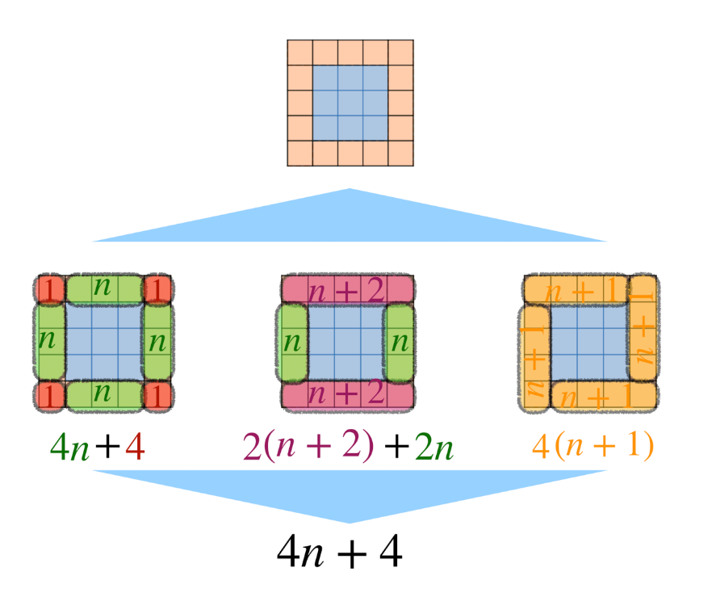

# Svømmebassengproblemet


## [Svømmebassengproblemet- desmos aktivitet](https://teacher.desmos.com/activitybuilder/custom/5bed3808b5f7d83ef23cd7c0)



{:.input_area}
```python
#Spør om antall fliser i bunnen
bunn = input("Hvor mange fliser skal det være i bredden på ditt kvadratiske basseng?")
bunn = int(bunn)  #konverterer fra string til integer (tekst til tall)

# Beregner antall fliser
ant_flis = 4*bunn + 4        # eller 2*(bunn+2) + 2*bunn eller  4*(bunn + 1)

print("Du trenger", ant_flis, " fliser")

```


{:.input_area}
```python
# Mulig utvidelse

pris1 = 119
pris2 = 449.50

print("Velkommen til svømmebassengdesigneren.")

#Spør om input fra brukeren
bunn = input("Hvor mange fliser skal det være i bredden på ditt kvadratiske basseng?")
bunn = int(bunn)  #koverterer fra str til int (tekst til tall)
flistype = input("Hvilken flistype velger du? Tast 1 for enkel grå (NOK 119) eller 2 for turkis mosaikk (NOK 449,50)")


# Beregner antall fliser
ant_flis = 4*bunn + 4        # eller 2*(bunn+2) + 2*bunn eller  4*(bunn + 1)

if flistype == "1":
    print("Du trenger", ant_flis, "fliser, og det vil koste", ant_flis*pris1, "kroner")
elif flistype == "2":
    print("Du trenger", ant_flis, "fliser, og det vil koste", ant_flis*pris2, "kroner")
else: 
    print("Jeg skjønner ikke hva du mener. Dropp bassenget og kjøp noen fine julegaver istedenfor.")

```


{:.output .output_stream}
```
Velkommen til svømmebassengdesigneren.
Hvor mange fliser skal det være i bredden på ditt kvadratiske basseng?7
Hvilken flistype velger du? Tast 1 for enkel grå (NOK 119) eller 2 for turkis mosaikk (NOK 449,50)3
Jeg skjønner ikke hva du mener. Dropp bassenget og kjøp noen fine julegaver istedenfor.

```

## Oppgave
1. Utvid programmet til å be om prosentvis rabatt og regne ut ny pris.
2. Tenk ut flere mulige utvidelser av programmet, og prøv dem. 
